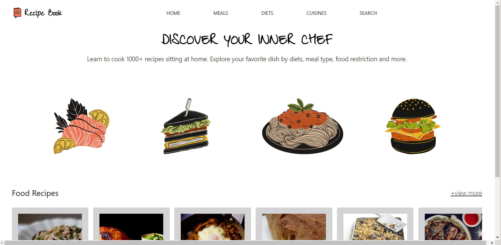
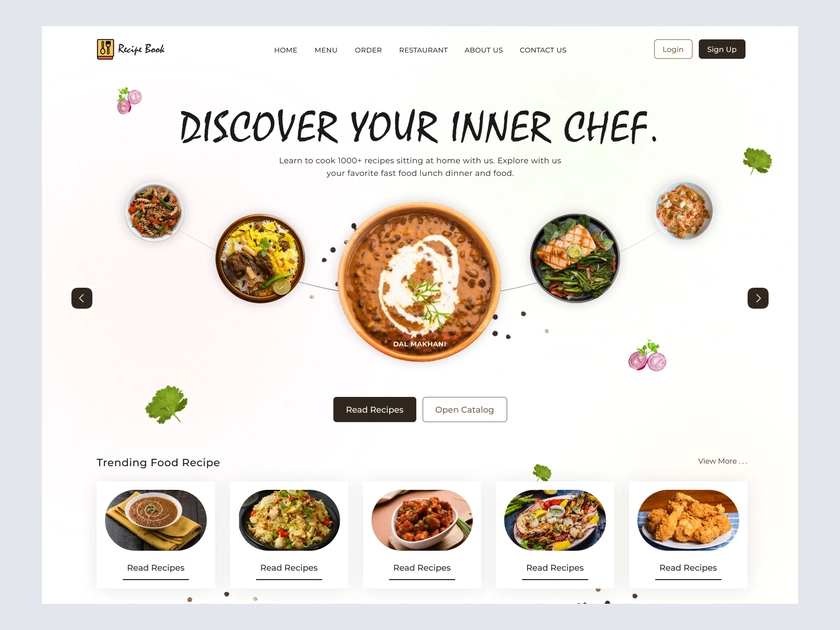
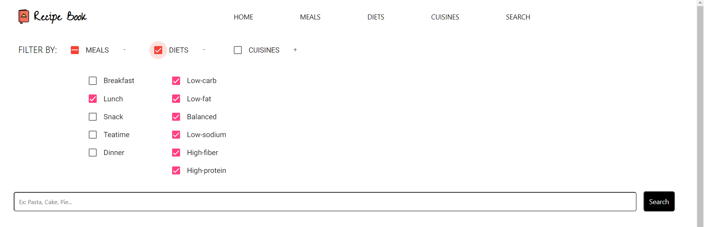
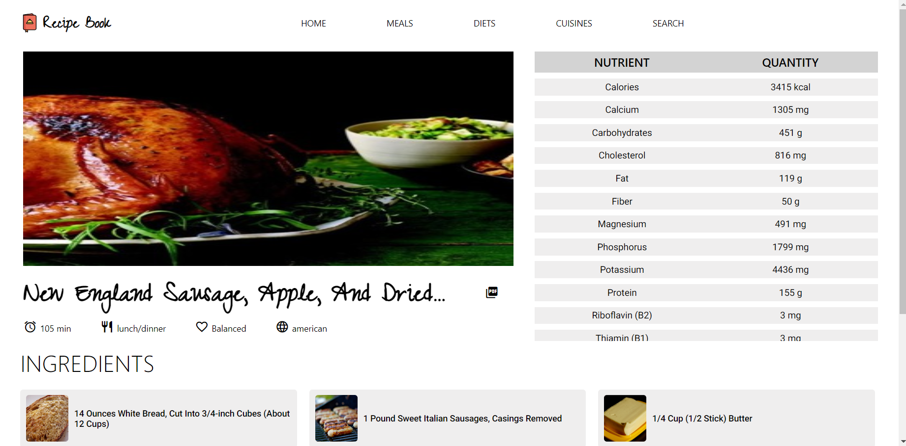

# Recipes

This site can show you and search recipes according to specific meals, diets, cuisine types and much more.

## 💡 About the project

This project was generated with [Angular CLI](https://github.com/angular/angular-cli), version 15.0.5.

The desing was inspired in this picture found on Dribbble, posted by Rishabh Singh.

## 🔥 Project features

The user can:

- search for specific dishes using filters, navigate by meals, diets and cuisine types;

- see the image, time, calories, meal, diet, cuisine type, nutritional information and the ingrediets for each recipe and

- make download the recipe informations.

## ✔ Used resources

- Integration of API 'https://api.edamam.com/api/recipes/v2'.

## 🏁 Open and run the project

First, create your app_key and app_id on 'https://developer.edamam.com/edamam-docs-recipe-api'.

After that, clone the project and open it with your favorite IDE.

Insert your app_key and app_id on:
  - lines 11 and 12 of the services/recipes.service.ts and
  - line 89 of the pages/search-page/search-page.component.ts.

Finally, run `ng serve` for a dev server.

Navigate to `http://localhost:4200/`. 

The application will automatically reload if you change any of the source files 🏆.
